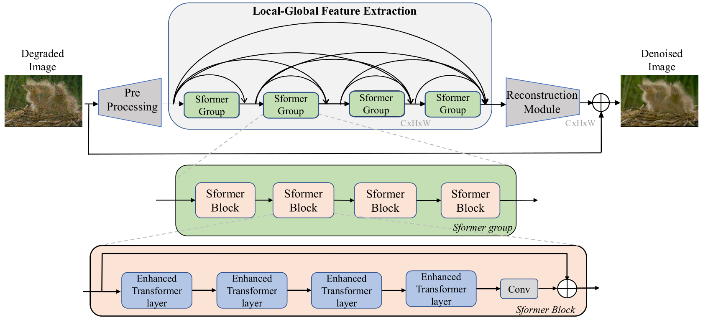
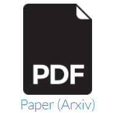

## DenSformer: Dense residual Transformer for Image Denoising. 
---

<div align=center>
<p>
<a href="https://www.bjtu.edu.cn">Beijing Jiaotong University</a>
</p>

<p>
<a href="https://www.ustb.edu.cn">University of Science and Technology Beijing</a>
</p>

<p>
<a href="https://iis.bjtu.edu.cn">Institute of Information Science</a>
</p>
</div>

----
### Abstract

Image denoising is an important low-level computer vision task, which aims to reconstruct a noise-free and high-quality image from a noisy image. In this paper, we proposed an image denoising network structure based on Transformer, which is named DenSformer. DenSformer consists of three modules, including a preprocessing module, a local-global feature extraction module, and a reconstruction module. Specifically, the local-global feature extraction module consists of several Sformer groups, each of which has several ETransformer layers and a convolution layer, together with a residual connection. These Sformer groups are densely skip-connected to fuse the feature of different layers, and they jointly capture the local and global information from the given noisy images. Experimental results prove that our DenSformer achieves improvement compared to some state-of-the-art methods. In synthetic noise removal, DenSformer outperforms other methods by up to 0.13-0.39 dB in gray-scale images and color images. In real noise removal, DenSformer can achieve comparable performance, while the number of parameters can be reduced by up to 40%. 

---

### Method

Pipeline of proposed **Dense residual network** consisted of Enhanced Transformer.

<div align=center> 
</div>

**Enhanced Transformer**

<div align=center>
 
</div>

For more details see [Paper](https://arxiv.org).

<!-- For more details see [Basic writing and formatting syntax](https://docs.github.com/en/github/writing-on-github/getting-started-with-writing-and-formatting-on-github/basic-writing-and-formatting-syntax). -->

---

### Results

**Synthesis Noise dataset CBSD68**

<div align=center>

</div>

**Real Noise dataset SIDD**

<div align=center>

</div>

<!-- Your Pages site will use the layout and styles from the Jekyll theme you have selected in your [repository settings](https://github.com/Kimsure/DenSformer/settings/pages). The name of this theme is saved in the Jekyll `_config.yml` configuration file. -->

----

### Citation and Reference

<div align=center>
<a href="https://github.com/Kimsure/DenSformer" target="-blank" title="Github">
 
</a>
<a href="https://arxiv.org/abs/2205.06944" target="-blank" title="paper">

</a>
</div>


```BibTex
@article{2022DenSRT,
  title={Dense Residual Transformer for Image Denoising},
  author={Chao Yao and Shuo Jin and Meiqin Liu and Xiaojuan Ban},
  journal={arXiv preprint arXiv:2205.06944},
  year={2022}
}
```
