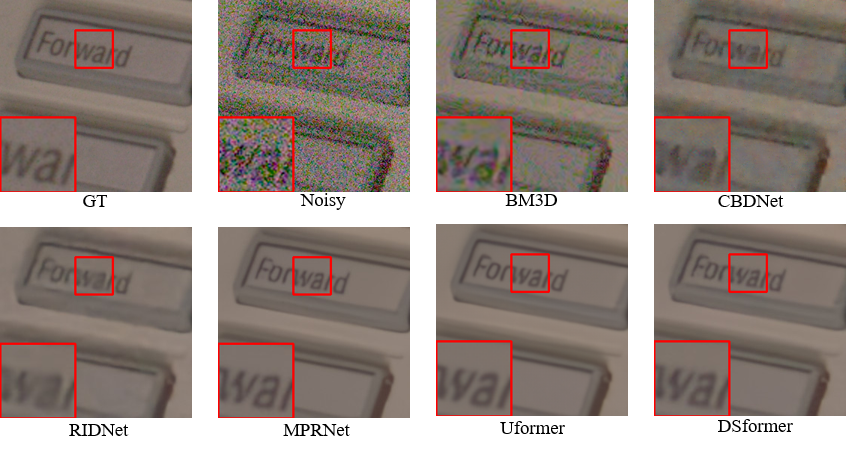

## DSFormer: A Dense residual network with Enhanced Transformer for image denoising. 
---

Yao chao and Jin shuo and Liu meiqin and Ban xiaojuan

----
### Abstract

Image denoising is an important low-level computer vision task, which aims to reconstruct a noise-free and high-quality image from a noisy image. In this paper, we proposed an image denoising network structure based on Transformer, which is named DSformer. DSformer consists of three modules, including a preprocessing module, a local-global feature extraction module, and a reconstruction module. Specifically, the local-global feature extraction module consists of several Sformer groups, each of which has several ETransformer layers and a convolution layer, together with a residual connection. These Sformer groups are densely skip-connected to fuse the feature of different layers, and they jointly capture the local and global information from the given noisy images. Experimental results prove that our DSformer achieves improvement compared to some state-of-the-art methods. In synthetic noise removal, DSformer outperforms other methods by up to 0.22 dB in gray-scale images and 0.13 dB in color images. In real noise removal, DSformer can achieve comparable performance, while the number of parameters can be reduced by up to 40\%. 

---

### Method

Pipeline of proposed Dense residual network consisted of Enhanced Transformer.

<div align=center> 
</div>

**Enhanced Transformer**

<div align=center>
 
</div>

For more details see [Paper](https://docs.github.com/en/github/writing-on-github/getting-started-with-writing-and-formatting-on-github/basic-writing-and-formatting-syntax).

<!-- For more details see [Basic writing and formatting syntax](https://docs.github.com/en/github/writing-on-github/getting-started-with-writing-and-formatting-on-github/basic-writing-and-formatting-syntax). -->

---

### Results

**Synthesis Noise dataset Kodak**

<div align=center>

</div>

**Real Noise dataset SIDD**

<div align=center>

</div>

<!-- Your Pages site will use the layout and styles from the Jekyll theme you have selected in your [repository settings](https://github.com/Kimsure/DSFormer/settings/pages). The name of this theme is saved in the Jekyll `_config.yml` configuration file. -->

----

### Citation and Reference
```BibTex
@article{zhang2021plug, 
  title={DSFormer: A Dense residual network with Enhanced Transformer for image denoising. },
  author={Yao, chao and Jin, shuo and Liu, meiqin and Ban, xiaojuan},
  journal={ },
  year={2022}
}
```